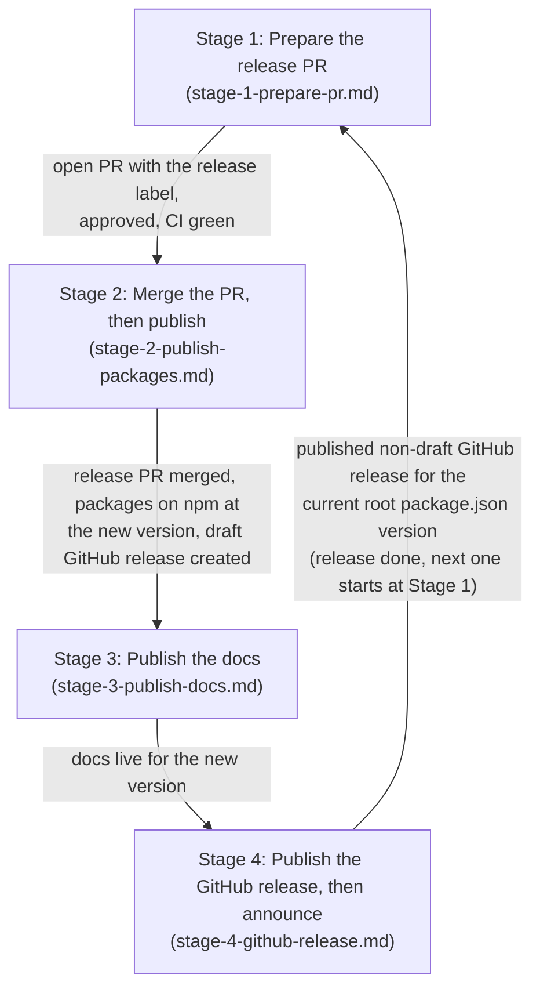

# MUI Release

Every MUI repo releases through the same staged pipeline. Each stage depends on the previous one completing — never start a stage before its predecessor is done. This skill describes the shared skeleton; the details vary per repo.

**Resumable:** the skill can be invoked at any stage — a release often spans multiple sessions (e.g. the PR was created and merged earlier, and the user now wants to trigger the npm publish). In the pipeline diagram below, each arrow out of a stage states the observable evidence that the stage is complete: resume at the first stage whose evidence is missing. Confirm the detected stage with the user before continuing; earlier stages' outputs are inputs, not work to redo.

**Source of truth:** the target repo's `scripts/README.md` is the authoritative, evolving runbook. Always read it in the target checkout before releasing; use this skill to know what the stages mean and what to expect. Where the README contradicts this skill, the README wins. Repo-specific steps (docs release pages, hotfix flows, prerelease progressions, docs-only deploys, first-time package publishing) live only there. Repos without that runbook: read their release workflow directly.

## The pipeline

Each stage's instructions live in its own file — after detecting and confirming the current stage, read **that stage's file**:



Verify each stage's evidence with read-only commands (run in the target checkout; `<version>` is the root `package.json` version):

```bash
# release PR: open (stage 1) or merged (stage 2 done merging)
gh pr list --label release --state open --json number,title,reviewDecision
gh pr list --label release --state merged --limit 1 --json number,title,mergedAt
gh pr checks <number>                      # CI green?

# packages on npm at the new version
npm view <main-package>@<version> version

# GitHub release: exists? still a draft?
gh release list --limit 5 --json tagName,isDraft,isLatest
gh release view "v<version>" --json tagName,isDraft

# docs live for the new version
curl -s <docs-url> | grep "<version>"      # or check the Netlify dashboard
```
