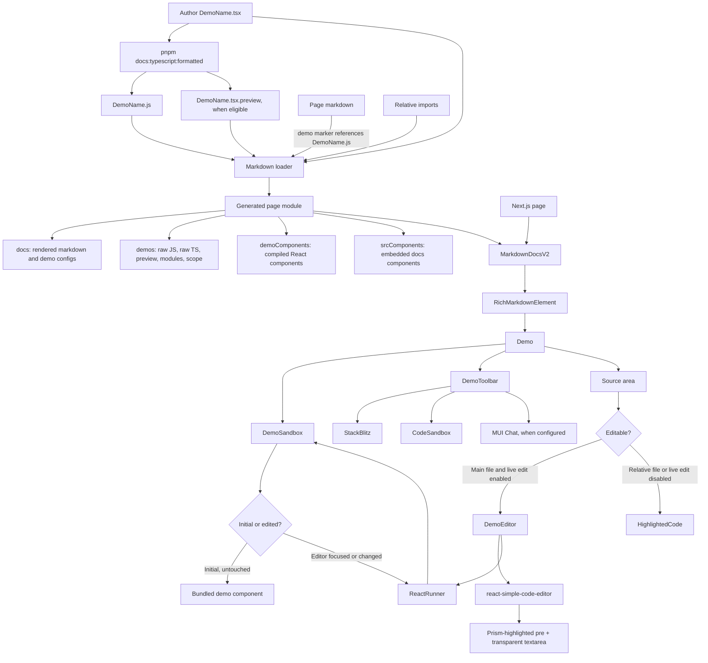
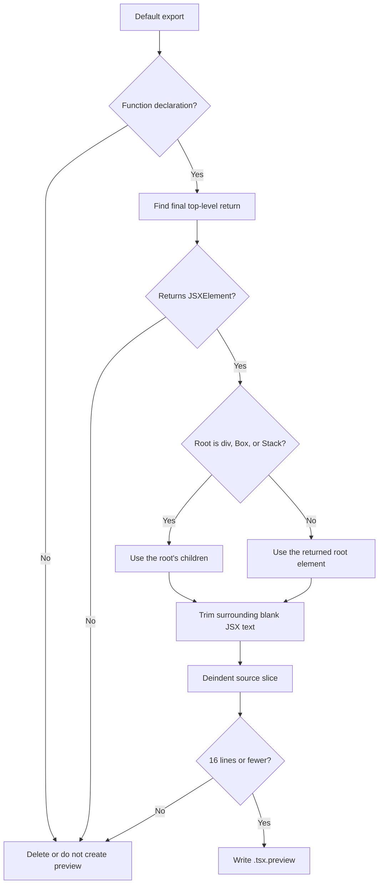
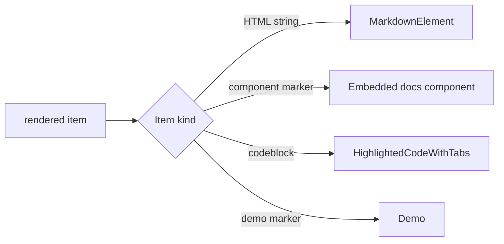
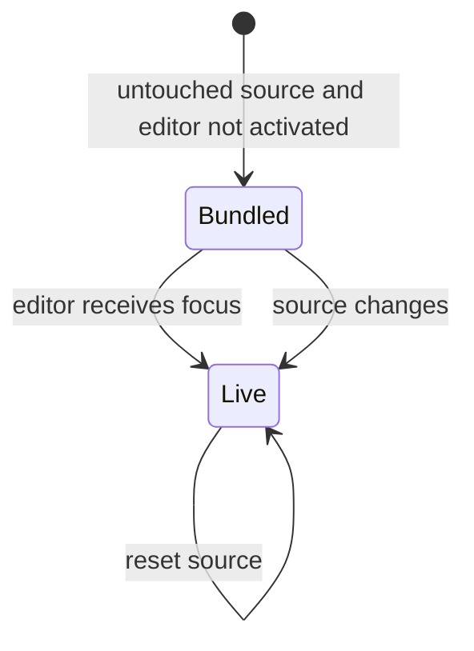

# Documentation demo rendering map

This document maps a Material UI documentation demo from its TypeScript source to the rendered preview, source editor, toolbar actions, and external sandboxes.

## System map



## Example file chain

A typical Button demo uses these files:

```text
docs/pages/material-ui/react-button.js
  imports docs/data/material/components/buttons/buttons.md?muiMarkdown

docs/data/material/components/buttons/buttons.md
  contains {{"demo": "BasicButtons.js"}}

docs/data/material/components/buttons/BasicButtons.tsx
  is the authored demo

docs/data/material/components/buttons/BasicButtons.js
  is generated from the TypeScript demo

docs/data/material/components/buttons/BasicButtons.tsx.preview
  is the generated short source preview
```

The page module renders the loader output:

```jsx
import MarkdownDocs from 'docs/src/modules/components/MarkdownDocsV2';
import * as pageProps from 'docs/data/material/components/buttons/buttons.md?muiMarkdown';

export default function Page() {
  return <MarkdownDocs {...pageProps} />;
}
```

## 1. Write a demo

Author the TypeScript file next to its page Markdown file. The normal shape is a default-exported, named function component:

```tsx
import Stack from '@mui/material/Stack';
import Button from '@mui/material/Button';

export default function BasicButtons() {
  return (
    <Stack spacing={2} direction="row">
      <Button variant="text">Text</Button>
      <Button variant="contained">Contained</Button>
      <Button variant="outlined">Outlined</Button>
    </Stack>
  );
}
```

Follow these repository conventions:

- Author the `.tsx` file. Treat the `.js` and `.tsx.preview` files as generated artifacts.
- Use one-level package imports, such as `@mui/material/Button`, instead of a package barrel import.
- Default-export the component that the docs must render.
- Keep the returned example focused. A short final return can become the inline source preview.
- Put helper components, state, constants, and types in the same file when practical.
- You can use relative imports. The loader recursively collects those files for source tabs and external sandboxes.
- A toolbar-enabled Markdown marker must reference the generated `.js` file. Direct `.ts` or `.tsx` references are rejected unless `hideToolbar` is `true`.

After editing a demo, run:

```bash
pnpm docs:typescript:formatted
```

You can limit the formatter with its `--pattern` option during local iteration.

### What the formatter generates

`docs/scripts/formattedTSDemos.mjs` scans TypeScript files under `docs/src/pages` and `docs/data`. For each eligible file, it:

1. Parses TypeScript with Babel's TypeScript preset.
2. Runs `babel-plugin-jsx-preview` as a side effect.
3. Generates runtime prop types when applicable.
4. Removes TypeScript-only syntax and `@ts-ignore` lines.
5. Formats the JavaScript with Prettier.
6. Corrects Babel generator and line-ending differences.
7. Writes the sibling `.js` file.

The script skips declarations, `types.ts`, configured ignored files, premium-theme demos, and getting-started templates where applicable.

## 2. Generate the short source preview

The preview file is source text, not a separately rendered React component. For `DemoName.tsx`, the generator writes `DemoName.tsx.preview` only when all preview rules pass.



Important details:

- The Babel plugin inspects only a default-exported function declaration.
- It uses the last top-level `return` statement in that function body.
- The returned node must be a JSX element. A fragment does not qualify.
- For `div`, `Box`, and `Stack` roots, the plugin extracts the children so the preview shows the meaningful lines instead of a layout wrapper.
- The maximum is 16 lines.
- If a formerly eligible demo becomes ineligible, the plugin deletes the stale preview file.
- The plugin slices the original TypeScript source by AST offsets, then removes common indentation. It does not reconstruct JSX from generated JavaScript.

For `BasicButtons.tsx`, the preview is:

```tsx
<Button variant="text">Text</Button>
<Button variant="contained">Contained</Button>
<Button variant="outlined">Outlined</Button>
```

A missing preview is valid. It changes only the initial source-panel behavior.

## 3. Insert a demo into Markdown

Use a JSON object inside the demo marker:

```md
{{"demo": "BasicButtons.js"}}
```

`packages-internal/markdown/parseMarkdown.mjs` splits Markdown at demo and embedded-component markers. `prepareMarkdown.mjs` parses each marker as JSON and leaves normal Markdown as rendered HTML strings.

### Demo marker options

|      Option       |                                                                                     Effect                                                                                     |
| :---------------: | :----------------------------------------------------------------------------------------------------------------------------------------------------------------------------: |
|      `demo`       |                                              Required module path, relative to the Markdown file after legacy path normalization.                                              |
|   `hideToolbar`   |                       Omits the toolbar, source panel, source anchors, AI prompt, and inline ad. The loader also skips editable-source import analysis.                        |
| `defaultCodeOpen` |                              Starts with full source open when `true`. When `false`, it suppresses the generated short preview and starts closed.                              |
|       `bg`        | Controls the demo container. Supported implementations include `outlined`, `inline`, `gradient`, `playground`, and `true`. The default is `outlined`, or `true` for an iframe. |
|     `iframe`      |                                                        Renders the demo into an iframe document through a React portal.                                                        |
|    `isolated`     |                                          Disconnects inherited Material UI theme context and passes isolation props to the demo root.                                          |
|    `maxWidth`     |                                                                   Sets the sandbox wrapper's maximum width.                                                                    |
|     `height`      |                                                                       Sets the sandbox wrapper's height.                                                                       |
| `disableLiveEdit` |                         Displays highlighted source instead of the editor. Use this for iframe demos that cannot receive the editor runner's `window`.                         |
| `hideEditButton`  |                                                                   Hides StackBlitz and CodeSandbox actions.                                                                    |
|    `disableAd`    |                                                      Prevents the demo's inline ad from appearing after source expansion.                                                      |
|    `anchorId`     |                                                   Replaces the default source anchor name. Set it to `null` to omit anchors.                                                   |
|  `aiSuggestion`   |                                      Adds an AI customization prompt after the source panel when the public chat endpoint is configured.                                       |

The runtime validates these combinations:

- Do not set `hideToolbar: false`; it is already the default.
- Do not combine `hideToolbar: true` with `defaultCodeOpen: true`.
- Do not combine `hideToolbar: true` with `disableAd: true`.
- Do not reference a TypeScript file directly when the toolbar is visible.

Extra JSON keys survive parsing, but `Demo` has no effect for keys it does not explicitly consume. For example, an older `theme` marker option is not part of the current `DemoProps` contract.

## 4. Build-time Markdown and demo loading

The Next.js page imports Markdown with `?muiMarkdown`. `docs/next.config.ts` sends that request through `@mui/internal-markdown/loader` under both webpack and Turbopack.

The loader performs these operations:

1. Loads the English Markdown and eligible translations.
2. Renders ordinary Markdown and parses demo marker objects.
3. Collects unique demo names from the English document.
4. Resolves each referenced `.js` module relative to the Markdown file.
5. Reads the JavaScript source into `raw`.
6. Reads sibling `.tsx`, `.tsx.preview`, and supported styling variants when present.
7. Extracts imports for the live-runner scope and sandbox dependencies.
8. Resolves relative imports, including nested relative imports, and stores their raw source by JavaScript or TypeScript variant.
9. Emits static imports for every demo component, imported package namespace, and embedded docs component.
10. Exports serializable docs metadata plus maps that connect source strings to compiled components.

The generated module has four important exports:

```ts
interface GeneratedMarkdownModule {
  docs: Record<
    Language,
    {
      rendered: Array<string | DemoOptions | ComponentOptions>;
      location: string;
      title: string;
      description: string;
      // Headers and table of contents are also included.
    }
  >;
  demos: Record<
    DemoName,
    {
      module: string;
      raw: string;
      moduleTS?: string;
      rawTS?: string;
      jsxPreview?: string;
      relativeModules?: Record<'JS' | 'TS', Array<{ module: string; raw: string }>>;
    }
  > & { scope: LiveRunnerScope };
  demoComponents: Record<ModuleId, React.ComponentType>;
  srcComponents: Record<ComponentMarkerPath, React.ComponentType>;
}
```

### Live-runner scope

The loader emits namespace imports for dependencies found in demo source and exposes them as:

```js
demos.scope = {
  process: {},
  import: {
    '@mui/material/Button': ImportedButtonModule,
    // Other imported modules.
  },
};
```

`react-runner` uses this map to evaluate normal import statements without fetching or bundling packages in the browser. In development, `ReactRunner` replaces `process` with a proxy that throws on property access because runtime `process.x` access is unsupported.

### Multiple source files

The loader resolves extensionless relative imports using this order:

- JavaScript source: `.js`, `.jsx`, `.ts`, `.tsx`.
- TypeScript source: `.ts`, `.tsx`, `.js`, `.jsx`.

It reads nested relative dependencies recursively. The main source and collected files later appear as source tabs and external-sandbox files. The main file is the only live-editable tab; related files use the static highlighter.

### Styling variants

For directory-based demos, the loader can also collect System, Tailwind, and plain CSS variants and their previews. The current `Demo` implementation receives these fields and detects that alternate variants exist, but it does not select or render them. `CodeStylingProvider` still persists `system`, `tailwind`, or `css` from cookies and source hashes. In the current toolbar, alternate-variant presence adds only a divider before the JavaScript and TypeScript controls. Treat this path as partially wired rather than a complete styling switcher.

## 5. Turn loader output into a `Demo`

`MarkdownDocsV2` walks `localizedDoc.rendered`. Each item goes to `RichMarkdownElement`:



For a demo marker, `RichMarkdownElement` combines:

- The marker as `demoOptions`.
- Raw JavaScript and TypeScript source from `demos`.
- The generated preview source.
- Compiled JavaScript and TypeScript components from `demoComponents`.
- The import scope.
- Relative module source.
- A GitHub URL built from the repository URL, library version, page location, and demo name.
- An analytics label built from the demo's repository-relative location.
- The docs-specific `DemoToolbar` slot.

`DocsApp` supplies page-wide providers for code copying, selected code language, selected styling solution, product metadata, the AI editor, sandbox configuration, docs theme, and analytics. `AppFrame` supplies `DemoPageThemeProvider`, which creates page-level Material UI CSS variables once for all demos.

## 6. Render the visible demo

`Demo` chooses source data according to the global JavaScript or TypeScript preference. The preference:

- Defaults to TypeScript.
- Can be initialized from a `.js` or `.tsx` URL hash.
- Otherwise uses the `codeVariant` cookie.
- Resolves the hash and cookie in the browser before synchronizing the React state after hydration.
- Persists changes to that cookie for one year.
- Applies the preference to every demo on the page and on later navigations.
- Falls back to JavaScript when a demo has no TypeScript source.

The demo has two rendering paths:



### Bundled path

Before editing starts, `Demo` renders the statically imported component. This path supports server rendering and avoids compiling the demo in the browser. The component is memoized so unrelated UI state, such as toolbar hover, does not rerender it unnecessarily.

### Live path

After the editor receives focus or its value differs from the initial value, `Demo` renders `ReactRunner` instead of the bundled component. `ReactRunner` calls `react-runner`'s `useRunner`, which uses Sucrase internally to transform JSX and TypeScript and evaluates imports against the loader-generated scope.

For a short preview edit, `Demo`:

1. Removes leading indentation from the full raw source and preview source.
2. Replaces the exact preview substring in the full source with the edited preview text.
3. Sends the reconstructed full module to `ReactRunner`.

For full-source mode, it sends the editor value directly.

Preview and full-source editors are separate editing sessions. Expanding an edited preview discards the preview edit and initializes the editor from the original full source. Collapsing after a full-source edit discards that edit and restores the original generated preview. The transition remounts `DemoEditor`, so selection and undo history do not cross modes.

`react-runner` caches the last valid element when a later edit fails to transform. Therefore, a syntax error can appear above the editor while the last successfully rendered demo remains visible. Top-level evaluation failures, such as an explicit `throw`, appear through the same runner error channel.

Runner errors are debounced by 300 ms and displayed in `DemoEditorError`, an `aria-live="polite"` error alert over the editor. Render-time crashes outside the runner are caught by `DemoErrorBoundary`, which displays the exception, a reset action, and a prefilled GitHub issue link.

### Reset behavior

The reset action:

- Restores the current mode's initial editor text.
- Increments a key to remount `DemoSandbox` and clear component state.
- Clears a crash through the remount.

Changing JavaScript or TypeScript or switching between preview and full-source mode also resets editor text. This reset is observable only when the selected variants differ; generated JavaScript and authored TypeScript can otherwise be textually identical. `DemoEditor` receives a new key when preview mode changes, which clears its undo and redo history.

## 7. Isolate and theme the demo

`DemoSandbox` wraps all demo rendering in an error boundary.

### Normal demo

A normal demo uses `DemoInstanceThemeProvider`. It creates a Material UI theme with:

- Light and dark color schemes.
- The current text direction.
- Current density settings.
- High-contrast enhancement.
- Reduced-motion settings.
- An optional runtime theme injected by the docs environment.

It deliberately avoids inheriting the docs branding theme as the demo's Material UI theme.

### Isolated demo

With `isolated: true`, the sandbox inserts a System `ThemeProvider` that disconnects normal theme inheritance. It clones the demo root with these theme-provider inputs:

- `cssVarPrefix` based on the demo name.
- `colorSchemeNode` for the demo container or iframe document element.
- `colorSchemeSelector="class"`.
- `disableNestedContext`.
- `storageManager={null}`.
- `documentNode` and `window` when an iframe exists.

The demo must pass these received props to its own theme provider.

### Iframe demo

With `iframe: true`, `DemoIframe` creates an iframe with `srcDoc`, Roboto font links, and an empty body. After the iframe load event, React portals the demo into the iframe body.

`FramedDemo` then:

- Creates an Emotion cache that writes styles into the iframe head.
- Loads RTL Stylis support only when required.
- Sets `dir`, `color-scheme`, and `data-mui-color-scheme` on the iframe document.
- Clones the demo with a `window` getter.
- Injects default Material UI theme CSS variables unless the demo is isolated.
- Supports a product-specific iframe wrapper through `DemoContext`.

Firefox receives special load-state handling so portaled content is not inserted before the iframe is ready.

## 8. Decide which source appears

The source panel has three initial states:

| Preview file | `defaultCodeOpen`  | Initial source state                                                                                    |
| -----------: | :----------------: | :------------------------------------------------------------------------------------------------------ |
|      Present | Omitted or `true`  | Source area is visible. Omitted starts with the short editable preview; `true` starts with full source. |
|      Present |      `false`       | Source is closed.                                                                                       |
|      Missing |       `true`       | Full source is open.                                                                                    |
|      Missing | Omitted or `false` | Source is closed.                                                                                       |

Internally:

```ts
showPreview = !hideToolbar && defaultCodeOpen !== false && Boolean(jsxPreview);

openDemoSource = codeOpen || showPreview;
isPreview = !codeOpen && showPreview;
```

A matching URL hash, such as `#BasicButtons.tsx`, opens the demo source automatically. The demo emits anchors for:

- `#BasicButtons`
- `#BasicButtons.js`
- `#BasicButtons.tsx`
- Styling-prefixed JavaScript and TypeScript forms, such as `#system-BasicButtons.tsx`

`anchorId` can rename these anchors or disable them with `null`.

## 9. Render and edit source

### Editable main file

The main source tab renders `DemoEditor` unless `disableLiveEdit` is set. It uses `react-simple-code-editor`, whose core model is:

```text
positioned container
├── highlighted <pre aria-hidden> generated from the current value
└── transparent <textarea> with matching typography and spacing
```

The user edits the textarea while seeing the highlighted `<pre>` beneath it. This is not a syntax-aware AST editor: Prism re-highlights the complete string after each value change, while the textarea provides native selection, input, undo, and redo behavior.

`DemoEditor` configures:

- A monospace 13 px editor using the docs theme's code font.
- A dark code surface and `color-scheme: dark`.
- A scroll container limited to `min(68vh, 1000px)`.
- No wrapping: the textarea and `<pre>` use `white-space: pre`.
- A visually hidden `Edit code` label.
- An editor copy button, hidden visually in this demo layout because the toolbar owns copying.
- An error alert slot.

Keyboard entry and exit are explicit:

- The textarea starts with `tabIndex={-1}`.
- Focus lands on a visible-on-focus editor hint.
- Enter moves focus into the textarea.
- Escape returns focus to the editor hint.
- Tab is left to the editor's normal handling.

### Static source

A related module, or any demo with `disableLiveEdit`, renders `HighlightedCode` instead. It:

1. Trims the code for display.
2. Calls the shared Prism helper.
3. Inserts the highlighted HTML into `<code class="language-jsx|tsx">`.
4. Uses `MarkdownElement` for code-block styling.

The source panel limits static code to `min(68vh, 1000px)` and preserves the untrimmed source for toolbar copying.

### Syntax highlighting

`packages-internal/markdown/prism.mjs` loads Prism grammars for CSS, Bash, diff, JavaScript, JSON, JSX, markup, YAML, and TSX. The demo passes `jsx` for JavaScript and `tsx` for TypeScript. The helper also maps generic `js` to JSX and `ts` to TSX.

Prism returns tokenized HTML. `HighlightedCode` and `DemoEditor` insert that HTML with `dangerouslySetInnerHTML`; Prism escapes source text as part of tokenization. Theme CSS supplies token colors and code-block presentation.

## 10. Toolbar map

The toolbar is rendered below the demo at the `sm` breakpoint and above. `DemoToolbarRoot` hides it on smaller screens. It uses `role="toolbar"` and a roving tab index:

- Left and Right Arrow move between controls, respecting text direction.
- Home moves to the first control.
- End moves to the last control.
- Hidden JavaScript and TypeScript controls are removed from keyboard navigation while full source is closed.

```text
Toolbar
├── Edit in Chat                         conditional
├── JavaScript / TypeScript selector                     visible while full source is open
├── Expand, collapse, or hide code
├── Edit in StackBlitz                   unless hideEditButton
├── Edit in CodeSandbox                  unless hideEditButton
├── Copy source
├── Reset focus
├── Reset demo
└── More
    ├── View on GitHub
    ├── Copy link to JavaScript source
    ├── Copy link to TypeScript source
    └── Deployment links                 staging and pull-request builds only
```

### Edit in Chat

This action appears only when the AI editor API URL and scopes are configured and the current product is allowed. It sends:

- The selected JavaScript or TypeScript source.
- Relative source files.
- Inferred dependencies.
- The product's primary package and version.
- The demo title and page title.

It displays loading state, restores focus after completion when needed, opens the returned URL in a new tab, and reports failures in a snackbar.

`aiSuggestion` is a separate optional prompt below the source area. It sends the TypeScript source and relative TypeScript files to the public chat endpoint. No Markdown demo currently uses this option.

### JavaScript and TypeScript selector

The selector changes a page-wide preference, not only one demo. The choice persists in the `codeVariant` cookie. The TypeScript button is disabled when `rawTS` is unavailable. Changing the language resets the source and editor state for each demo as it receives the new context value.

### Expand, collapse, show, or hide code

The labels describe two distinct state machines:

- A visible short preview uses **Expand code** to replace it with full source and **Collapse code** to restore the preview.
- A demo with no visible preview uses **Show code** to mount full source and **Hide code** to unmount it.

`defaultCodeOpen: false` suppresses a generated preview, so that demo uses Show and Hide even if a `.tsx.preview` file exists. A matching source hash opens full source directly.

Opening or closing full source sets inline-ad eligibility. The source itself animates through a 150 ms `Collapse` and unmounts when closed.

### StackBlitz

The StackBlitz action builds an in-memory Vite project with:

- `index.html` and font links.
- `src/index.jsx` or `src/index.tsx`.
- `src/Demo.jsx` or `src/Demo.tsx`.
- Flattened relative source files.
- `vite.config.js` or `vite.config.ts`.
- `package.json` with Vite scripts.
- TypeScript configuration for TypeScript demos.

The project uses the selected language variant's raw source, not unsaved text from `DemoEditor`. It scans imports in both the main file and relative files to infer dependencies, adds React and Emotion peers, applies product-specific dependency hooks, and uses `pkg.pr.new` package URLs on pull-request deployments. It posts each generated file through a form to StackBlitz in a new window.

### CodeSandbox

The CodeSandbox action builds a Create React App project with equivalent demo and relative files, `public/index.html`, package metadata, and TypeScript configuration when needed. It serializes `{ files }` as JSON, compresses it with LZString, converts Base64 to a URL-safe form, and submits it to CodeSandbox's Define API by POST form. The `query` field selects `src/Demo.js` or `src/Demo.tsx` as the initial file.

For both external editors, relative files are flattened to sibling files under `src`. `flattenRelativeImports` rewrites parent-directory imports such as `../data/options` to `./options` so the generated flat project remains resolvable. Filename collisions are possible because directory names are discarded; demo authors should avoid relative files with the same basename.

### Copy source

The toolbar copy action copies the raw source for the active tab. It changes from the copy icon to a check icon for one second. It does not copy the edited editor value; it copies the loader-provided raw file for the selected JavaScript or TypeScript variant and tab. Selecting a related-file tab changes the copied value to that file's raw source.

The editor and static highlighter also contain `CodeCopyButton`, but demo-specific CSS hides that nested button in favor of the toolbar action. At the app level, `CodeCopyProvider` supports Ctrl+C or Command+C for the active hovered or focused code block when the user has no native text selection.

### Reset focus

An invisible `InitialFocus` button sits at the top-left of the demo container. Reset focus calls its `focusVisible()` action, moving keyboard focus out of controls inside the example and back to a stable starting point.

### Reset demo

Reset restores source text and remounts the sandbox. This clears local React state and reruns component initialization.

### More menu

The menu always includes:

- The selected variant's GitHub source location. Selecting TypeScript points to `.tsx`; selecting JavaScript points to `.js`. The link opens in a new tab.
- A copyable page hash for JavaScript source, such as `#BasicButtons.js`.
- A copyable page hash for TypeScript source, such as `#BasicButtons.tsx`.

The copy-link items do not change the current URL. They copy an absolute URL built from the current page without its existing hash and append the selected demo anchor. Navigating to that URL opens full source and initializes the global language preference from the extension.

Staging and pull-request builds can also include links to the pull-request deployment, `next`, the exact deployment permalink, and `master`. Copy-link actions report success in a three-second snackbar.

All primary toolbar interactions include analytics category, action, and demo-location labels.

## 11. Source tabs

When a demo has relative modules and full source is open, Base UI Tabs renders one tab per source file:

```text
DemoName.tsx | helper.ts | data.ts
```

The first tab is the main source and can be edited. Every later tab uses static highlighting because `ReactRunner` receives the already bundled import scope rather than an editable virtual file system. The toolbar copy action follows the active tab.

No tab list appears for a single-file demo or while the short preview is displayed. Switching languages rebuilds the list from that variant's `relativeModules`; file names and contents can differ between JavaScript and TypeScript.

## 12. Layout, backgrounds, and ads

The visible demo and its tools are separate stacked regions:

```text
Root
├── anchor
├── DemoRoot
│   ├── InitialFocus
│   └── DemoSandbox
│       └── bundled component or ReactRunner
└── tools, unless hideToolbar
    ├── source anchors
    ├── DemoToolbarRoot
    ├── optional source tabs
    ├── collapsible source editor or viewer
    ├── optional AI suggestion
    └── optional inline ad
```

Background behavior:

- `outlined`: paper-like background, border, and padding.
- `inline`: removes desktop padding and gives the toolbar its own top border and margin.
- `gradient`: larger responsive padding, scrolling, border, and radial background.
- `playground`: paper background, border, and scrolling.
- `true`: neutral translucent background, border, and padding.
- Omitted: `outlined` for normal demos and `true` for iframe demos.

The demo container and toolbar share rounded corners. Opening source removes the toolbar's lower rounding so the code block can continue the same surface. The full source area has a maximum height of 68 viewport height or 1,000 px.

An inline Carbon ad becomes eligible only after the user toggles source. Page-level and marker-level settings can disable it. It renders after the source and optional AI prompt.

## 13. Copy, accessibility, and failure details

- `NoSsr` wraps toolbar and copy-button behavior that depends on `window` or browser APIs.
- The toolbar has an accessible label and proper toolbar keyboard behavior.
- Source expansion uses `aria-controls` to point to the editor/source ID.
- The source tabs use `tabpanel` only when a tab list exists.
- Runner and chat errors use polite live regions or snackbars.
- The iframe has a demo-specific title.
- The editor's copy and focus behavior preserves native text selection.
- Hash navigation opens matching source and selects JavaScript or TypeScript from the extension.
- `DemoErrorBoundary` provides a recoverable UI instead of breaking the complete documentation page.

## 14. Testing paths

Demo code participates in several checks:

- `pnpm docs:typescript:formatted` keeps `.tsx`, `.js`, and `.tsx.preview` artifacts synchronized.
- `pnpm typescript` checks authored TypeScript.
- `pnpm eslint` checks demo implementation and docs infrastructure.
- `pnpm test:regressions` imports demo modules directly through Vite, captures Chromium screenshots, and runs selected axe checks.
- `test/regressions/demoMeta.ts` controls screenshot and accessibility enrollment with last-match-wins globs.
- Accessibility output is stored by component slug in `*.a11y.json` files.

The regression fixture path is independent of the Markdown `Demo` shell: it renders demo components directly to validate their visual and accessibility output. Toolbar, editor, Markdown-loader, and full-page behavior therefore require docs-page or focused infrastructure tests rather than only demo screenshots.

### End-to-end migration contract

`test/e2e-website/demo-docs.spec.ts` exercises the complete shell on ordinary Material UI documentation routes. Its migration contract includes:

- Bundled initial rendering, generated previews, Prism output, and full-source rendering.
- Preview editing, the preview-to-full-source reset boundary, full-source editing, syntax failures, and top-level evaluation failures.
- Editor keyboard entry and exit.
- Stateful demo remounting through **Reset demo**.
- Explicit **Expand code**/**Collapse code** and **Show code**/**Hide code** behavior.
- Hydration-time language selection, hash selection, language switching, edit reset, cookie persistence, and navigation persistence.
- Relative-module tabs, read-only related files, and active-tab copying.
- `hideToolbar` and `disableLiveEdit`.
- GitHub links for the selected language and copied JavaScript and TypeScript source URLs.
- Toolbar keyboard navigation, focus reset, and responsive toolbar hiding.
- StackBlitz and decoded CodeSandbox payloads, including relative files, root files, package metadata, and TypeScript configuration.
- Isolated and iframe color-scheme behavior on the docs-infrastructure route.

Run the complete website suite against a local docs server with:

```bash
PLAYWRIGHT_TEST_BASE_URL=http://localhost:3000 pnpm test:e2e-website
```

Running `pnpm test:e2e-website` without `PLAYWRIGHT_TEST_BASE_URL` uses `https://mui.com` by default. The public site does not expose `/experiments/docs/demos/`, so the infrastructure-only theme tests require a local or preview deployment that includes that route. Local builds can also lack translated pages and DocSearch network behavior; failures in those existing suites are separate from the demo-shell tests.

## 15. Source inventory

|                      Area                       |                              Primary file                              |
| :---------------------------------------------: | :--------------------------------------------------------------------: |
|             Demo authoring guidance             |                           `CONTRIBUTING.md`                            |
| TypeScript-to-JavaScript and preview generation |                  `docs/scripts/formattedTSDemos.mjs`                   |
|               Preview extraction                |          `docs/src/modules/utils/babel-plugin-jsx-preview.js`          |
|        Markdown splitting and rendering         |             `packages-internal/markdown/parseMarkdown.mjs`             |
|          Markdown metadata preparation          |            `packages-internal/markdown/prepareMarkdown.mjs`            |
|         Demo source and import loading          |                `packages-internal/markdown/loader.mjs`                 |
|           Next.js loader registration           |                         `docs/next.config.ts`                          |
|         Page-level Markdown composition         |            `docs/src/modules/components/MarkdownDocsV2.js`             |
|             Markdown-item dispatch              | `packages-internal/core-docs/src/MarkdownDocs/RichMarkdownElement.tsx` |
|           Demo state and composition            |            `packages-internal/core-docs/src/Demo/Demo.tsx`             |
|           Theme and iframe isolation            |         `packages-internal/core-docs/src/Demo/DemoSandbox.tsx`         |
|             Per-demo theme creation             |     `packages-internal/core-docs/src/Demo/DemoThemeProviders.tsx`      |
|                Toolbar behavior                 |         `packages-internal/core-docs/src/Demo/DemoToolbar.tsx`         |
|                 Toolbar layout                  |       `packages-internal/core-docs/src/Demo/DemoToolbarRoot.ts`        |
|                 Editable source                 |         `packages-internal/core-docs/src/Demo/DemoEditor.tsx`          |
|                 Live execution                  |         `packages-internal/core-docs/src/Demo/ReactRunner.tsx`         |
|               Static highlighting               | `packages-internal/core-docs/src/HighlightedCode/HighlightedCode.tsx`  |
|                   Prism setup                   |                 `packages-internal/markdown/prism.mjs`                 |
|                  Copy behavior                  |        `packages-internal/core-docs/src/CodeCopy/CodeCopy.tsx`         |
|            Code language preference             |     `packages-internal/core-docs/src/codeVariant/codeVariant.tsx`      |
|               Styling preference                |     `packages-internal/core-docs/src/codeStyling/CodeStyling.tsx`      |
|         CodeSandbox project generation          |     `packages-internal/core-docs/src/Demo/sandbox/CodeSandbox.ts`      |
|          StackBlitz project generation          |      `packages-internal/core-docs/src/Demo/sandbox/StackBlitz.ts`      |
|          Sandbox dependency inference           |     `packages-internal/core-docs/src/Demo/sandbox/Dependencies.ts`     |
|          AI editor project generation           |       `packages-internal/core-docs/src/Demo/sandbox/MuiChat.ts`        |
|               App-level providers               |         `packages-internal/core-docs/src/DocsApp/DocsApp.tsx`          |
|         Material sandbox root template          |                         `docs/pages/_app.tsx`                          |
|          Regression fixture collection          |                     `test/regressions/fixtures.js`                     |
|        Screenshot and axe configuration         |                     `test/regressions/demoMeta.ts`                     |
|           Demo-shell end-to-end tests           |                  `test/e2e-website/demo-docs.spec.ts`                  |
|        Website Playwright configuration         |                `test/e2e-website/playwright.config.ts`                 |
